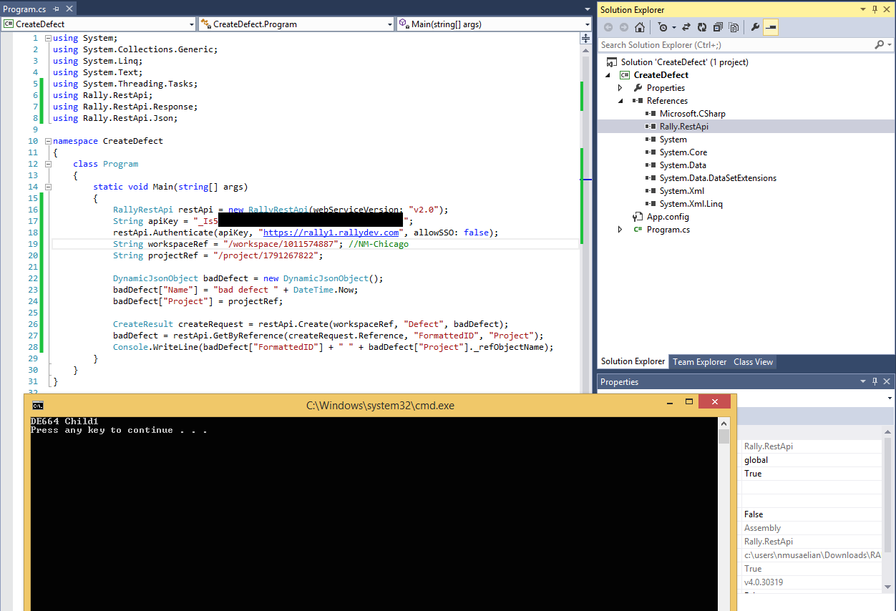
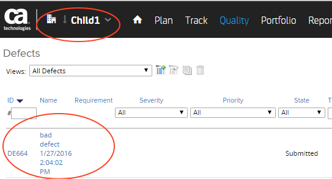

Create Defect
=========================

## Overview
This C# console app is  based on [Rally Rest Toolkit for .NET](https://github.com/RallyTools/RallyRestToolkitFor.NET)
and tested with 3.0.1 dll

The code is authenticated with [ApiKey](https://help.rallydev.com/rally-application-manager) 

Success:

## License
These code examples are  available AS IS, for illustration purposes only. They are NOT supported by Rally.
AppTemplate is released under the MIT license.  See the file [LICENSE](./LICENSE) for the full text.

##Documentation for API toolkit

You can find the documentation on this [site.](https://github.com/RallyTools/RallyRestToolkitForJava/wiki/User-Guide)
