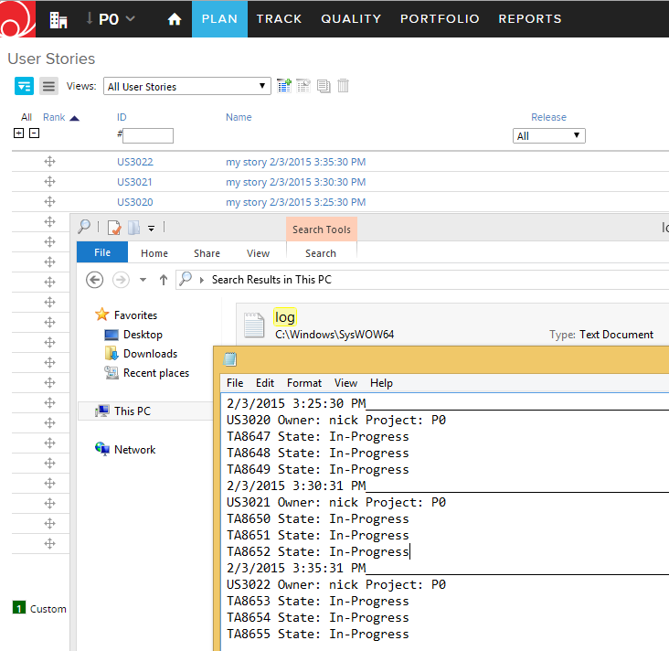
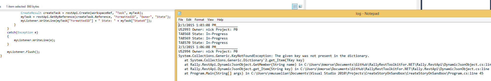

Create User Story with Tasks and Log results
=========================

## Overview
This C# example is  based on [Rally Rest Toolkit for .NET](https://github.com/RallyTools/RallyRestToolkitFor.NET)
and tested with 2.0.1 dll

Make sure to change Target Framework from default .NET Framework 4 Client Profile as described in the toolkit's User Guide

The purpose is to log the output of this console application to a log file. Errors will also be recorded. For example, if a code references a Rally attribute that does not exist (misspelled as StateX) the excepton is recorded:

The executable file is scheduled to run using Windows Task Scheduler:

## License
These code examples are  available AS IS, for illustration purposes only. They are NOT supported by Rally.
AppTemplate is released under the MIT license.  See the file [LICENSE](./LICENSE) for the full text.

##Documentation for API toolkit

You can find the documentation on this [site.](https://github.com/RallyTools/RallyRestToolkitForJava/wiki/User-Guide)
