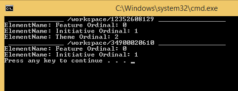

Get PI types per workspace
=========================

## Overview
These C# examples are based on [Rally Rest Toolkit for .NET](https://github.com/RallyTools/RallyRestToolkitFor.NET)
and tested with 3.0.1 dll

PI types in Rally workspaces are customizible. This example shows how to query for existing PI types per workspace. 

This screenshot showing the console output. The first workspace has 3 PI types, the second workspace has two.

## License
These code examples are  available AS IS, for illustration purposes only. They are NOT supported by Rally.
AppTemplate is released under the MIT license.  See the file [LICENSE](./LICENSE) for the full text.

##Documentation for API toolkit

You can find the documentation on this [site.](https://github.com/RallyTools/RallyRestToolkitFor.NET)
