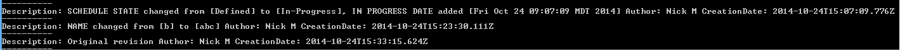
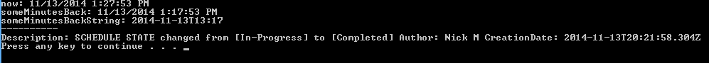

Revision Examples
=========================

## Overview
These C# examples are based on [Rally Rest Toolkit for .NET](https://github.com/RallyTools/RallyRestToolkitFor.NET)
and tested with 2.0.1 dll

Make sure to change Target Framework from default .NET Framework 4 Client Profile 

to .NET Framework 4. The former is a subset of the latter.

Here is a screenshot showing the console output from Get Revisions By Creation Date One Month Back:

Here is a screenshot showing the console output from Get Revisions By Creation Date Minutes Ago:

## License
These code examples are  available AS IS, for illustration purposes only. They are NOT supported by Rally.
AppTemplate is released under the MIT license.  See the file [LICENSE](./LICENSE) for the full text.

##Documentation for API toolkit

You can find the documentation on this [site.](https://github.com/RallyTools/RallyRestToolkitForJava/wiki/User-Guide)
