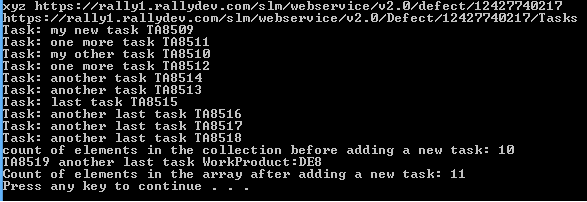

Create Task, add it to a Defect's Tasks Collection
=========================

## Overview
These C# example is based on [Rally Rest Toolkit for .NET](https://github.com/RallyTools/RallyRestToolkitFor.NET)
and tested with 2.0.1 dll

Make sure to change Target Framework from default .NET Framework 4 Client Profile as described in the toolkit's User Guide

Here is a screenshot showing the console output after the app is run:

## License
These code examples are  available AS IS, for illustration purposes only. They are NOT supported by Rally.
AppTemplate is released under the MIT license.  See the file [LICENSE](./LICENSE) for the full text.

##Documentation for API toolkit

You can find the documentation on this [site.](https://github.com/RallyTools/RallyRestToolkitForJava/wiki/User-Guide)
