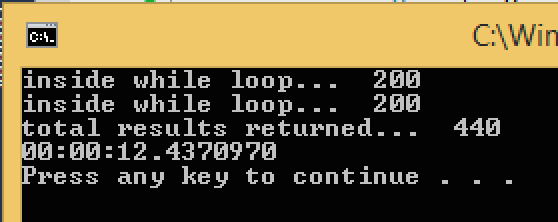
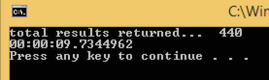

Manual Paging vs Automatic Paging with Limit property
=========================

## Overview

When Limit property on the Request is set to a high number that is greater than a total result count your query you ever expect to return the Request's PageSize is automatically set by the toolkit to the max 200 and paging happens automatically.
Here is a screenshot showing the console output after the app with manual paging is run:

The first screenshot shows the output of ManualPagingTest.cs that runs against a project with 440 stories:

The second screenshot shows the output of AutoPagingTest.cs that runs against the same project:

440 results are returned by both.

These C# examples are based on [Rally Rest Toolkit for .NET](https://github.com/RallyTools/RallyRestToolkitFor.NET)
and tested with 2.0.1 dll

Make sure to change Target Framework from default .NET Framework 4 Client Profile as described in the toolkit's User Guide
## License
These code examples are  available AS IS, for illustration purposes only. They are NOT supported by Rally.
AppTemplate is released under the MIT license.  See the file [LICENSE](./LICENSE) for the full text.

